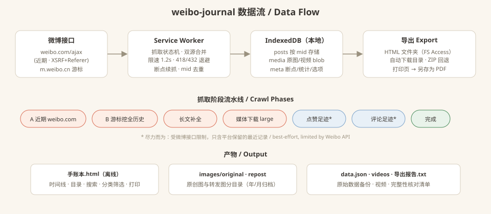

# Weibo Journal / 微博手账本

**[English](#features--功能)** | [中文](#features--功能)

A Chrome extension (Manifest V3) that exports **all your own Weibo posts** into a scrapbook-styled local archive: an offline timeline journal (HTML), original-quality images sorted into `original` / `repost` folders, long-text completion, original/repost/media category filtering, and print / PDF output. No build step, zero dependencies, all data stays on your machine.

一个 Chrome 扩展（Manifest V3）：把**自己的全部微博**导出为手账本风格的本地档案——离线可开的纵向时间线手账本（HTML）、原图按**原创 / 转发**分目录归档、长文自动补全、原创/转发/媒体类型分类勾选筛选，并支持**打印与另存为 PDF**。无需构建、零依赖，数据全部留在本机。

---

## Features / 功能

**English:**

- **Full-history scraping**: dual-source merge & dedup (by mid) — `weibo.com/ajax/statuses/mymblog` for recent posts + `m.weibo.cn` `since_id` cursor for deep history; completeness is verified against your profile's `statuses_count` ("1801 / 1797" style report in the journal header).
- **Category system**: every post is tagged 原创 (original) / 转发 (repost) with a blue badge on reposts; images are physically separated into `images/original/` and `images/repost/` (archived by year/month).
- **Complete content**: long posts are completed via the longtext API — including the original text of reposted Weibo; images are always downloaded at `large` original quality (3741/3741 successful in our 1797-post real run, 0 failures); 头条文章 are fetched at original text when Weibo's visibility window allows (older articles degrade to title + link).
- **Check-to-build**: pick 原创 / 转发 / 仅含图片 / 仅含视频 / 仅纯文字 before generating; the generated journal keeps interactive filters (category chips, year buttons, full-text search, month TOC) — filter first, then print.
- **Timeline browsing**: vertical timeline with date rail, washi-tape month stickers, polaroid-style image grids, lazy loading, click-to-zoom lightbox.
- **Print & PDF**: built-in 🖨 print button with print-optimized layout (print header, page-break-safe cards); the export page opens a print tab that auto-invokes the print dialog — choose "Save as PDF" for a vector-text, searchable PDF.
- **Four export paths**: File System Access folder picker, one-click auto-export to `~/Downloads/微博手账本/` (no dialog), ZIP single-file fallback, print-to-PDF.
- **Resilient crawling**: 1.2s/request rate limit, exponential backoff on 418/403/432, checkpoint resume across browser restarts, auto-switch to the mobile API when the desktop one rejects (logged-out), failed media queued for retry and listed in the report.
- **Footprint (best-effort)**: liked/commented Weibo fetched when the API allows — clearly labeled as best-effort in the journal, never promised as complete.

**中文：**

- **全量历史抓取**：双接口合并、按 mid 去重——近期走 `weibo.com/ajax/statuses/mymblog`，深挖历史走 `m.weibo.cn` since_id 游标；以资料页微博总数核对完整性（手账本顶部显示「1801 / 1797」式报告条）。
- **分类体系**：每条微博标注原创 / 转发（转发卡片带蓝色角标）；图片物理分离到 `images/original/` 与 `images/repost/`（按年/月归档）。
- **内容完整**：超长微博经长文接口补全全文（含转发原博全文）；图片一律 `large` 原图（实测 1797 条全量导出 3741/3741 张成功、0 失败）；头条文章在微博可见期允许时抓取正文（超过半年可见期的文章保留标题+链接）。
- **勾选后生成**：导出前勾选 原创 / 转发 / 仅含图片 / 仅含视频 / 仅纯文字；生成后的手账本仍保留交互筛选（分类胶囊、年份按钮、全文搜索、月份目录）——先筛选再打印，PDF 只含筛选结果。
- **时间线翻阅**：纵向时间线 + 日期轨道、和纸胶带月份贴纸、拍立得图片墙、懒加载、点击放大。
- **打印与 PDF**：内置 🖨 打印按钮，打印版式已适配（页眉、卡片防跨页截断）；导出页可打开打印页并自动呼出打印对话框，目标选「存储为 PDF」即得矢量文字版 PDF。
- **四条导出路径**：File System Access 选择文件夹 / 一键自动导出到 `~/Downloads/微博手账本/`（免选择）/ ZIP 单文件回退 / 打印转 PDF。
- **韧性抓取**：1.2 秒/请求限速，418/403/432 指数退避，关浏览器断点续抓，未登录访问被拒时自动切移动端接口，失败媒体入重试队列并记入报告。
- **足迹（尽力而为）**：点赞/评论过的微博在接口允许时抓取——手账本中明确标注为尽力而为，不承诺全量。

---

## Getting Started / 使用教学

### Step 1 / 第 1 步：Install the Extension / 安装扩展

**English:**
1. Download this repository (`Code → Download ZIP` and extract, or `git clone`).
2. Enter `chrome://extensions` in your browser address bar and press Enter (Edge: `edge://extensions`).
3. Turn on the **Developer mode** switch in the top-right corner.
4. Click **Load unpacked** in the top-left and select this project folder.
5. Click the puzzle icon in the toolbar and **pin** this extension for easy access.

> Chrome 137 (mid-2025) removed the `--load-extension` command-line flag — "Load unpacked" in developer mode is the way. No dependencies to install, no build step required — pure vanilla JavaScript.

**中文：**
1. 下载本仓库代码（`Code → Download ZIP` 后解压，或 `git clone`）。
2. 浏览器地址栏输入 `chrome://extensions` 并回车（Edge 为 `edge://extensions`）。
3. 打开页面右上角的「开发者模式」开关。
4. 点击左上角「加载已解压的扩展程序」，选择本项目文件夹。
5. 点击工具栏拼图图标，把本扩展**固定（Pin）**到工具栏方便使用。

> Chrome 137（2025 年中）起移除了 `--load-extension` 命令行加载方式，必须走上面的「开发者模式 + 加载已解压」。无需安装任何依赖、无需构建，纯原生 JavaScript。

---

### Step 2 / 第 2 步：Log In & Start / 登录并开始

**English:**
1. Log in to <https://weibo.com> in the same browser (QR scan works). Logging in dramatically raises the crawl quota — logged-out sessions are capped at ~1 page by Weibo.
2. Click the extension icon ("微博手账本") in the toolbar.
3. Your UID and total post count are detected automatically from the login session (or enter a UID manually).
4. Tick the options you want — **图片原图（large 高清）/ 头条文章全文 / 视频文件 / 点赞足迹 / 评论足迹** — then click **开始导出 (Start Export)**. Text and long-post completion are always fully collected.
5. The crawl runs in phases: recent posts → deep-history cursor → long-text completion → media download → footprints. You can close the popup; closing the browser resumes from the checkpoint next time.

**中文：**
1. 在同一浏览器登录 <https://weibo.com>（扫码即可）。登录后抓取额度大幅提升——游客身份微博只放行约 1 页数据。
2. 点击工具栏上的扩展图标（「微博手账本」）。
3. UID 与微博总数会从登录态自动识别（也可手动填写 UID）。
4. 勾选需要的选项——**图片原图（large 高清）/ 头条文章全文 / 视频文件 / 点赞足迹 / 评论足迹**——然后点「**开始导出**」。文字与长文全文始终完整收录。
5. 抓取分阶段进行：近期微博 → 游标深挖全历史 → 长文补全 → 媒体下载 → 足迹。关闭弹窗不影响进度；关浏览器后下次打开会从断点自动续抓。

---

### Step 3 / 第 3 步：Monitor Progress / 查看进度

**English:**
Reopen the popup anytime to see live progress:

| Field | Meaning |
|-------|---------|
| 时间线微博 X / Y | Timeline posts stored / total from your profile |
| 图片 · 视频 成功/失败 | Media download counters (failures are listed and skippable) |
| Phase label | Current phase (e.g. "下载原图与视频") |
| ⚠ error box | Last errors — e.g. "weibo.com 接口拒绝访问（未登录）" means it auto-switched to the mobile API |

> Thousands of posts ≈ tens of minutes for text, plus media time. Videos are the slowest and largest — skip them if you don't need the files.

**中文：**
随时重新打开弹窗查看实时进度：

| 字段 | 含义 |
|------|------|
| 时间线微博 X / Y | 已入库时间线微博 / 资料页总数 |
| 图片 · 视频 成功/失败 | 媒体下载计数（失败会列出、可跳过不阻塞） |
| 阶段标签 | 当前所处阶段（如「下载原图与视频」） |
| ⚠ 错误栏 | 最近错误——如「weibo.com 接口拒绝访问（未登录）」表示已自动切到移动端接口 |

> 几千条微博的文字部分约几十分钟，媒体另计。视频最慢且体积最大——不需要视频文件可不勾选。

---

### Step 4 / 第 4 步：Export, Print & PDF / 导出、打印与 PDF

**English:**
Click **打开导出页 (Open Export Page)** in the popup after crawling:

1. **Pick categories**: 原创 / 转发 / 仅含图片 / 仅含视频 / 仅纯文字 — the journal is generated from your selection.
2. **Choose an output path**:
   - **选择文件夹并导出** — File System Access picker; writes `手账本.html + images/ + videos/ + data.json + 导出报告.txt` to any folder you pick.
   - **自动导出到下载文件夹** — no dialog; everything lands in `~/Downloads/微博手账本/`.
   - **导出为 ZIP** — single-file fallback for browsers without File System Access.
3. **Print / PDF**: click **打开打印页** — a new tab assembles the full journal (media loaded on the fly) and invokes the print dialog. Choose **Save as PDF** for a vector-text PDF; or use the 🖨 button inside any journal to print the current filtered view.
4. Open `手账本.html` — fully offline: timeline, month TOC, search, year & category filters, lightbox.

**中文：**
抓取完成后在弹窗点「**打开导出页**」：

1. **勾选分类**：原创 / 转发 / 仅含图片 / 仅含视频 / 仅纯文字——手账本按勾选生成。
2. **选择输出路径**：
   - **选择文件夹并导出**——File System Access 选择器；把 `手账本.html + images/ + videos/ + data.json + 导出报告.txt` 写入你选的文件夹。
   - **自动导出到下载文件夹**——免选择，全部写入 `~/Downloads/微博手账本/`。
   - **导出为 ZIP**——单文件回退，适合不支持 File System Access 的浏览器。
3. **打印 / PDF**：点「**打开打印页**」——新标签页即时装载全部媒体生成手账本并呼出打印对话框，目标选「**存储为 PDF**」即得矢量文字版 PDF；手账本内的 🖨 按钮则可打印当前筛选视图。
4. 双击打开 `手账本.html`——完全离线：时间线、月份目录、搜索、年份与分类筛选、图片放大。

---

## FAQ / 常见问题

**Q: Why did it only grab ~10 posts? / 为什么只抓到十几条？**
- **EN:** You were not logged in. Weibo caps logged-out API access hard. Log in to weibo.com in this browser, then click **开始导出** again (incremental — nothing is lost).
- **中文：** 未登录微博。游客身份接口限额极低。在本浏览器登录 weibo.com 后再点「开始导出」即可（增量抓取，已有数据不会丢）。

**Q: Why is the collected count higher than the total? / 为什么收录数比总数还多？**
- **EN:** The counter includes pinned posts and brief overlaps before dedup settles; the report bar reconciles against `statuses_count`. A few posts above total is normal and harmless.
- **中文：** 计数含置顶与去重落定前的短暂重叠；报告条以资料页总数为准核对。略多于总数属正常现象，无害。

**Q: Likes/comments footprint shows 0 or very few? / 点赞/评论足迹为什么是 0 或很少？**
- **EN:** Weibo's footprint APIs only expose a recent window and may return nothing for some accounts. This section is best-effort and labeled as such in the journal.
- **中文：** 微博的足迹接口只开放最近一段，部分账号完全不返回数据。该部分为尽力而为，手账本中已明确标注。

**Q: Some videos failed to download? / 为什么有视频下载失败？**
- **EN:** Weibo's video URLs are signed and expire; deleted videos are unrecoverable. Failed items keep their poster + online link in the journal and are listed in the report. The extension refreshes the URL right before downloading to minimize this.
- **中文：** 微博视频地址带签名会过期，被删除的视频无法找回。失败的视频在手账本中保留封面和在线链接，并记入报告。扩展会在下载前自动刷新视频地址以减少此类失败。

**Q: Where is data stored? Is it uploaded anywhere? / 数据存在哪里？会上传吗？**
- **EN:** Everything lives in your browser's IndexedDB on this machine. The exported folder is written wherever you choose. Nothing passes through any third-party server.
- **中文：** 所有数据存在本机浏览器 IndexedDB；导出文件夹写在你选择的位置。全程不经过任何第三方服务器。

---

## Architecture / 架构



```
weibo-journal/
├── manifest.json            # MV3 manifest（host_permissions 覆盖 weibo.com / *.weibo.cn / *.sinaimg.cn / *.weibocdn.com）
├── rules.json               # declarativeNetRequest：自动补 Referer（sinaimg 反盗链 + weibo ajax + 视频）
├── background/
│   └── sw.js                # Service Worker：消息路由、keep-alive、闹钟唤醒断点续抓
├── content/
│   └── content.js           # weibo.com 页面：读取 $CONFIG.uid（登录检测 / UID 自动填入）
├── popup/                   # 控制面板：登录检测、选项、开始/暂停/继续、实时进度、错误栏
├── export/
│   ├── export.html/js       # 导出页：分类勾选、四种导出路径（文件夹/自动下载/ZIP/打印页）
│   └── print.html/js        # 打印页：blob 地址装载媒体生成手账本，自动呼出打印对话框
└── lib/
    ├── api.js               # 微博接口封装：限速、退避、XSRF/Referer 头、登录检测
    ├── crawl.js             # 抓取状态机：A→B→长文→媒体→足迹，断点、去重、合并、报告
    ├── db.js                # IndexedDB：posts（mid 主键）/ media（blob）/ meta（断点统计）
    ├── imager.js            # 图片 URL 原图化（orj360/bmiddle→large）与分目录路径
    ├── journal.js           # 手账本 HTML 生成：内联 CSS/JS，分类筛选/目录/搜索/打印样式
    └── zip.js               # 零依赖 ZIP（store + CRC32）回退打包
```

---

## Data & Privacy / 数据与隐私

**English:**
- Posts, media blobs, checkpoints and stats are stored in IndexedDB under this browser profile — nothing leaves the machine except direct API calls to weibo.com / m.weibo.cn (same as normal browsing).
- The exported folder is plain files you own; `data.json` is the raw archive for re-import or further processing.
- **Clear data**: popup → 清空数据重来 wipes the extension database (export folders are untouched).

**中文：**
- 微博、媒体文件、断点与统计都存在本浏览器配置下的 IndexedDB——除与 weibo.com / m.weibo.cn 的直接接口请求（与正常浏览无异）外，数据不出本机。
- 导出的文件夹是你完全拥有的普通文件；`data.json` 是原始数据档案，可备份或二次处理。
- **清空数据**：弹窗 →「清空数据重来」会清空扩展数据库（已导出的文件夹不受影响）。

---

## Known Limitations / 已知限制

**English:**
- Weibo's web APIs are unofficial and may change; breaks land in `lib/api.js` (single point of change).
- Logged-out crawling is capped to ~1 page by Weibo — login is required for a full export of your own account.
- Likes/comments footprints are limited to whatever Weibo's API still exposes; not guaranteed complete.
- Some signed video URLs expire before download; those entries degrade to poster + online link.
- Very large archives (tens of thousands of media files) make the ZIP fallback memory-heavy — prefer the folder export paths.

**中文：**
- 微博网页接口非官方，可能随时变动；如失效只需改 `lib/api.js`（唯一改动点）。
- 游客身份抓取被微博限制在约 1 页——导出自己账号的完整数据必须登录。
- 点赞/评论足迹受接口限制，只含平台保留的最近记录，无法保证全量。
- 个别带签名的视频地址会在下载前过期，这类条目降级为封面 + 在线链接。
- 媒体极多时（数以万计）ZIP 回退方案内存占用高——优先使用文件夹导出。

---

## License / 许可

[MIT](LICENSE)
